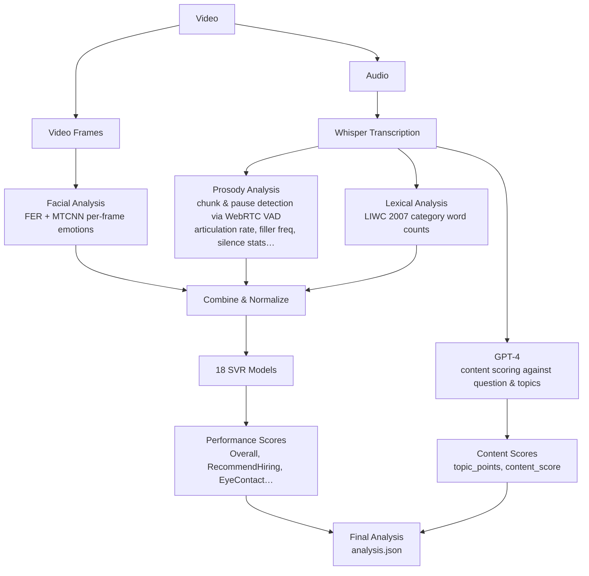

# JobTalk Analyzer

The analysis module of [JobTalk](https://github.com/4C1LSoftware), a recruitment platform that automates job interview evaluation using machine learning. Given a candidate's interview recording, it produces a structured report covering both **how** the candidate spoke (performance) and **what** they said (content).

## Flow



## Platform

JobTalk Analyzer is the AI component of **[JobTalk](https://github.com/4C1LSoftware)**, a recruitment platform that streamlines hiring by automating candidate evaluation. It eliminates human bias by assessing candidates purely through ML-based analysis of their interview recordings.

Key platform features:
- **Interview management** — recruiters create interview guides with custom questions and topic checklists tailored to each job profile
- **Asynchronous interviews** — candidates receive an invitation, record video responses to each question on their own time, and submit when done
- **Automated analysis** — once submitted, the platform scores both the content of answers and the candidate's delivery, producing a detailed report
- **Recruiter dashboard** — recruiters review per-candidate reports covering all 18 performance dimensions alongside per-question content scores

The platform uses a **PostgreSQL** database to store companies, recruiters, candidates, jobs, interview guides (questions + topic checklists), and the resulting analysis reports. The analyzer reads pending interviews from the database, processes them, and writes the results back once complete.

## Analysis Pipeline

The pipeline is split into two independent tracks that are merged at the end.

### Performance Analysis

Evaluates how the candidate delivered their response across three feature groups:

**Prosody** — extracted from the raw audio using [Praat](https://www.fon.hum.uva.nl/praat/) (low-level) and [WhisperX](https://github.com/m-bain/whisperX) word timestamps (mid-level):
- Low-level: formants (F1–F4), pitch (meanF0, stdevF0), jitter, shimmer, harmonics-to-noise ratio, spectral energy, intensity
- Mid-level: articulation rate, speech chunk lengths, silence durations, filled pause frequency (uh, um — detected via [WebRTC VAD](https://github.com/wiseman/py-webrtcvad)), linguistic complexity

**Lexical** — a word histogram over LIWC 2007 categories computed from the transcript: pronouns (I/we/they), speech disfluencies, emotions (positive/negative/anxiety/anger/sadness), cognitive and perceptual words, work-related words, grammar (articles, verbs, conjunctions, etc.)

**Facial** — per-frame emotion probabilities (angry, disgust, fear, happy, neutral) extracted using [FER](https://github.com/justinshenk/fer) with [MTCNN](https://github.com/timesler/facenet-pytorch) face detection, averaged across all frames.

All three feature vectors are concatenated, normalized (mean 0, stdev 1), and fed into **18 SVR models** — one per scoring category.

**Dataset** — Models were trained on the MIT job interview dataset, which contains recorded mock interviews scored by human raters across 18 performance dimensions.

**Evaluation** — To avoid bias from any single train/test split, models were evaluated over **1000 random 80/20 splits** of the dataset. The reported correlation and AUC scores are the mean across all 1000 splits, giving a robust estimate of generalization performance.

| Category | Correlation | AUC |
|---|---|---|
| Excited | 0.7463 | 0.8716 |
| EngagingTone | 0.7355 | 0.8538 |
| Friendly | 0.7076 | 0.8144 |
| Smiled | 0.6950 | 0.8321 |
| Engaged | 0.6468 | 0.7894 |
| StructuredAnswers | 0.6191 | 0.7896 |
| RecommendHiring | 0.6122 | 0.7727 |
| Colleague | 0.5484 | 0.7662 |
| Paused | 0.5266 | 0.7246 |

Plus: Overall, EyeContact, NoFillers, NotStressed, Focused, Authentic, NotAwkward, Calm, SpeakingRate.

### Content Analysis

The transcript is passed to **[GPT-4](https://openai.com/gpt-4)** along with the interview question and a recruiter-defined topic list. The LLM scores each topic:
- `0` — not addressed
- `1` — partially addressed
- `2` — fully addressed

A normalized content score is computed as:

```
content_score = sum(topic_scores) / (number_of_topics × 2)
```

Unlike keyword matching, GPT-4 handles contextual interpretation — e.g. a topic point of "Relational Database" can be matched by a candidate who mentions "SQL".

## Output

Both tracks are merged into a single `analysis.json`:

```
analysis/{candidate_id}/{interview_id}/{participant_id}/
├── transcription.json
├── prosody_features.json
├── lexical_features.json
├── facial_features.csv
├── combined_features.json
├── normalized_features.json
├── performance_analysis.json
├── content_analysis.json
└── analysis.json
```

## Requirements

- CUDA GPU (models run with `float16` compute)
- Python dependencies: see `requirements.txt`
- Key libraries: [WhisperX](https://github.com/m-bain/whisperX), [FER](https://github.com/justinshenk/fer), [parselmouth (Praat)](https://parselmouth.readthedocs.io), [webrtcvad](https://github.com/wiseman/py-webrtcvad), librosa, scikit-learn, OpenAI
